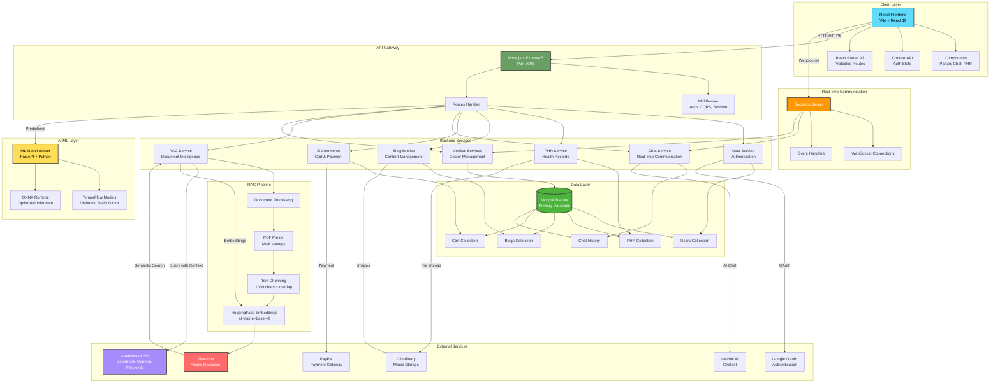
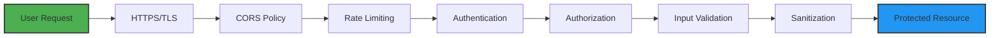

# 🏥 Vaidya

**Vaidya** is a comprehensive healthcare management system that combines modern web technologies with AI/ML capabilities to revolutionize patient care. This platform provides a complete ecosystem for patients, healthcare providers, and medical professionals, featuring health tracking, AI-powered diagnostics, e-commerce, and real-time communication tools.

---

## ✨ Key Features

### 🏥 Healthcare Management
- **Personal Health Records (PHR)**: Comprehensive medical history tracking for patients
- **AI-Powered Diagnostics**: ML models for disease prediction and health assessment
- **Medical Services**: Browse doctor profiles, services, and team information
- **Real-time Chat**: AI chatbot and live doctor consultations via Socket.io
- **RAG-Powered Document Intelligence**: Advanced PDF parsing with Retrieval-Augmented Generation for intelligent medical document analysis
- **Document Parser**: Extract, analyze, and query medical reports and prescriptions using AI

### 🛒 E-Commerce Platform
- **Health Essentials Store**: Browse and purchase healthcare products and medications
- **Shopping Cart**: Full-featured cart with payment integration
- **PayPal Integration**: Secure payment processing

### 📱 Content & Community
- **Blog Platform**: Create, read, and share health and wellness articles
- **Image Gallery**: Visual content management for medical resources
- **Educational Resources**: Health tips and wellness guides

### 🤖 AI/ML Capabilities
- **RAG System**: Retrieval-Augmented Generation with Pinecone vector database and Hugging Face embeddings
- **Intelligent Document Search**: Semantic search across medical documents using vector embeddings
- **Context-Aware AI Responses**: Query medical documents with AI-powered answers using OpenRouter models
- **Image Analysis**: Computer vision models for medical image assessment
- **Text Processing**: NLP for document understanding and chat
- **Predictive Models**: Disease prediction (e.g., diabetes detection)
- **Brain Tumor Detection**: Advanced diagnostic models

### 🔐 User Management
- **Authentication**: Secure login/signup with Passport.js
- **Google OAuth**: Social login integration
- **Protected Routes**: Role-based access control
- **Session Management**: Persistent user sessions with MongoDB

---

## 🛠️ Tech Stack

### Frontend
- **Framework**: React 19 with React Router v7
- **Build Tool**: Vite 6
- **Styling**: Custom CSS with Autoprefixer
- **UI Libraries**: Lucide React (icons), Anime.js (animations)
- **State Management**: React Context API
- **Real-time**: Socket.io Client
- **API Integration**: Axios
- **AI Integration**: Google Generative AI
- **Testing**: Jest, React Testing Library

### Backend
- **Runtime**: Node.js with Express 5
- **Database**: MongoDB with Mongoose ODM
- **Session Store**: connect-mongo
- **Authentication**: Passport.js (Local & Google OAuth)
- **Real-time**: Socket.io
- **File Upload**: Multer with Cloudinary integration
- **PDF Processing**: pdf-parse, pdfjs-dist
- **AI/ML**: OpenAI API, Xenova Transformers
- **Vector DB**: Pinecone for embeddings
- **Email**: Nodemailer
- **Payment**: PayPal Checkout SDK

### ML Model Server
- **Framework**: FastAPI
- **ML Runtime**: TensorFlow, ONNX Runtime
- **Image Processing**: Pillow
- **Database**: MongoDB (PyMongo)
- **Server**: Uvicorn (ASGI)

### Development Tools
- **Linting**: ESLint 9
- **Code Quality**: Babel, Jest
- **Dev Server**: Nodemon (backend), Vite (frontend)

---

## 🏗️ System Architecture

### Architecture Diagram



### Data Flow

#### 1. **User Authentication Flow**
```
User → React Frontend → Express API → Passport.js → MongoDB
                                    ↓
                              Google OAuth (Optional)
                                    ↓
                              Session Store → Cookie
```

#### 2. **RAG Document Processing Flow**
```
PDF Upload → Multer → PDF Parser → Text Extraction
                                        ↓
                                  Text Chunking
                                        ↓
                              HuggingFace Embeddings
                                        ↓
                                  Pinecone Storage
```

#### 3. **Intelligent Query Flow**
```
User Query → Generate Embedding → Pinecone Search → Retrieve Top-K Chunks
                                                            ↓
                                                    Augment Prompt
                                                            ↓
                                            OpenRouter AI (DeepSeek/Gemma)
                                                            ↓
                                                    AI Response + Sources
```

#### 4. **Real-time Chat Flow**
```
User Message → Socket.io Client → Socket.io Server → Message Handler
                                                            ↓
                                                    Store in MongoDB
                                                            ↓
                                        Broadcast to Connected Users
```

#### 5. **ML Prediction Flow**
```
User Input → React Form → Express API → FastAPI Server
                                              ↓
                                    Load Model (TensorFlow/ONNX)
                                              ↓
                                        Preprocessing
                                              ↓
                                        Model Inference
                                              ↓
                                    Postprocessing → Results
```

### Technology Stack per Layer

| Layer | Technologies | Purpose |
|-------|-------------|---------|
| **Frontend** | React 19, Vite, React Router v7 | User interface and client-side logic |
| **API Gateway** | Express 5, Node.js | Request routing and middleware |
| **Authentication** | Passport.js, JWT, Google OAuth | User security and session management |
| **Database** | MongoDB, Mongoose | Data persistence |
| **Vector DB** | Pinecone | Document embeddings and semantic search |
| **ML/AI** | TensorFlow, ONNX, FastAPI | Machine learning predictions |
| **RAG** | HuggingFace Transformers, OpenRouter | Document intelligence |
| **Real-time** | Socket.io | WebSocket communication |
| **Storage** | Cloudinary | Media and document storage |
| **Payment** | PayPal SDK | Transaction processing |

### Security Layers



### Scalability Considerations

- **Horizontal Scaling**: Stateless API design allows multiple server instances
- **Database Indexing**: MongoDB indexes on frequently queried fields
- **Caching**: Redis/Memory cache for session and frequent queries
- **CDN**: Cloudinary CDN for static assets
- **Vector DB**: Pinecone handles millions of embeddings efficiently
- **Load Balancing**: Ready for nginx/AWS ALB integration
- **Microservices Ready**: Services can be separated into independent containers

---

## 📦 Installation & Setup

### Prerequisites
- Node.js (v18 or higher)
- Python 3.8+
- MongoDB (local or Atlas)
- npm or yarn

### Clone the Repository
```bash
git clone https://github.com/vaibhav-0310/Vaidya.git
cd Vaidya
```

### Backend Setup
```bash
cd server
npm install

# Create .env file with required variables:
# MONGODB_URI, SESSION_SECRET, GOOGLE_CLIENT_ID, 
# GOOGLE_CLIENT_SECRET, CLOUDINARY_URL, etc.

npm start
```

### Frontend Setup
```bash
cd client
npm install
npm run dev
```

### ML Model Server Setup
```bash
cd model_server
python -m venv venv
venv\Scripts\activate  # On Windows
# source venv/bin/activate  # On Mac/Linux

pip install -r requirements.txt
uvicorn app:app --reload
```

### Running the Full Stack
Open three terminals:

**Terminal 1 - Backend Server**
```bash
cd server
npm start
```

**Terminal 2 - Frontend Client**
```bash
cd client
npm run dev
```

**Terminal 3 - ML Model Server**
```bash
cd model_server
uvicorn app:app --reload
```

---

## 📂 Project Structure

```
Vaidya/
├── client/                 # React frontend application
│   ├── src/
│   │   ├── components/    # Reusable React components
│   │   │   ├── Praser.jsx           # PDF/Document parser component
│   │   │   ├── ProtectedRoutes.jsx  # Route protection wrapper
│   │   │   └── VetChat.jsx          # Medical chat interface
│   │   ├── context/       # React Context providers
│   │   │   └── AuthContext.jsx      # Authentication state management
│   │   ├── pages/         # Page components
│   │   │   ├── blogs/     # Blog management pages
│   │   │   ├── essentials/ # E-commerce product pages
│   │   │   ├── home/      # Landing and home pages
│   │   │   ├── models/    # AI/ML model interfaces
│   │   │   ├── phr/       # Personal Health Records
│   │   │   ├── user/      # Authentication pages
│   │   │   └── vet/       # Medical services pages
│   │   ├── utils/         # Utility components
│   │   │   ├── Chatbot.jsx   # AI chatbot component
│   │   │   ├── Navbar.jsx    # Navigation bar
│   │   │   └── footer.jsx    # Footer component
│   │   └── App.jsx        # Main application component
│   ├── test/              # Jest unit tests
│   └── vite.config.js     # Vite configuration
│
├── server/                # Node.js backend server
│   ├── routes/           # API route handlers
│   │   ├── blog.route.js      # Blog CRUD operations
│   │   ├── cart.route.js      # Shopping cart management
│   │   ├── chat.route.js      # Chat functionality
│   │   ├── essential.routes.js # Product management
│   │   ├── parser.routes.js   # Document parsing
│   │   ├── payment.route.js   # Payment processing
│   │   ├── phr.routes.js      # Health records
│   │   ├── user.routes.js     # User authentication
│   │   └── vet.routes.js      # Medical services
│   ├── schema/           # MongoDB schemas
│   │   ├── blogs.schema.js
│   │   ├── cart.schema.js
│   │   ├── chat.schema.js
│   │   ├── essentail.schema.js
│   │   ├── phr.schemas.js
│   │   ├── user.schema.js
│   │   └── vet.schemas.js
│   ├── middleware/       # Express middleware
│   ├── data/            # Sample/seed data
│   └── server.js        # Main server file
│
└── model_server/         # Python FastAPI ML server
    ├── models/          # ML models and notebooks
    │   ├── diabetes_model.onnx    # ONNX format model
    │   ├── model.h5               # Keras/TensorFlow model
    │   └── model_info.json        # Model metadata
    ├── app.py           # FastAPI application
    └── requirements.txt  # Python dependencies
```

---

## 🚀 API Endpoints

### Authentication
- `POST /api/user/signup` - User registration
- `POST /api/user/login` - User login
- `POST /api/user/logout` - User logout
- `GET /api/user/profile` - Get user profile
- `GET /auth/google` - Google OAuth login

### Personal Health Records
- `GET /api/phr` - Get all health records
- `POST /api/phr` - Create new health record
- `PUT /api/phr/:id` - Update health record
- `DELETE /api/phr/:id` - Delete health record

### Medical Services
- `GET /api/vet` - Get all doctors
- `GET /api/vet/:id` - Get specific doctor details
- `POST /api/vet` - Register new doctor

### Blogs
- `GET /api/blogs` - Get all blog posts
- `GET /api/blogs/:id` - Get specific blog post
- `POST /api/blogs` - Create new blog post
- `PUT /api/blogs/:id` - Update blog post
- `DELETE /api/blogs/:id` - Delete blog post

### E-Commerce
- `GET /api/essentials` - Get all products
- `GET /api/cart` - Get user's cart
- `POST /api/cart` - Add item to cart
- `DELETE /api/cart/:id` - Remove item from cart
- `POST /api/payment` - Process payment

### Chat & AI
- `POST /api/chat` - Send chat message
- `GET /api/chat/history` - Get chat history

### Document Intelligence (RAG)
- `POST /api/parser/pdf-upload` - Upload and process PDF documents with vector embeddings
- `POST /api/parser/ask` - Query documents using RAG with AI-powered responses
- `GET /api/parser/documents` - List uploaded documents
- `DELETE /api/parser/documents` - Delete user documents from vector database

### ML Model Server
- `POST /predict` - Make predictions using ML models
- `GET /models` - List available models
- `POST /analyze-image` - Analyze medical images

---

## 🧪 Testing

```bash
cd client
npm test
```

Run tests in watch mode:
```bash
npm test -- --watch
```

---

## 🔒 Environment Variables

### Backend (.env in server/)
```env
MONGODB_URI=your_mongodb_connection_string
SESSION_SECRET=your_session_secret
GOOGLE_CLIENT_ID=your_google_client_id
GOOGLE_CLIENT_SECRET=your_google_client_secret
CLOUDINARY_CLOUD_NAME=your_cloudinary_name
CLOUDINARY_API_KEY=your_cloudinary_key
CLOUDINARY_API_SECRET=your_cloudinary_secret
OPENAI_API_KEY=your_openai_key
OPENROUTER_API_KEY=your_openrouter_key
PINECONE_API_KEY=your_pinecone_key
PAYPAL_CLIENT_ID=your_paypal_client_id
PAYPAL_CLIENT_SECRET=your_paypal_secret
EMAIL_USER=your_email
EMAIL_PASS=your_email_password
PORT=5000
```

### ML Model Server (.env in model_server/)
```env
MONGODB_URI=your_mongodb_connection_string
MODEL_PATH=./models
PORT=8000
```

### Frontend (.env in client/)
```env
VITE_API_URL=http://localhost:5000
VITE_GEMINI_API_KEY=your_gemini_api_key
VITE_SOCKET_URL=http://localhost:5000
```

---

## 🎯 Key Components

### Frontend Components
- **AuthContext**: Manages user authentication state across the app
- **ProtectedRoutes**: HOC for route protection based on authentication
- **Chatbot**: AI-powered chatbot for healthcare queries
- **VetChat**: Real-time chat with medical professionals
- **Parser**: Document parser for medical records and prescriptions

### Backend Features
- **Passport Authentication**: Local and Google OAuth strategies
- **MongoDB Session Store**: Persistent sessions across server restarts
- **Socket.io Integration**: Real-time bidirectional communication
- **Cloudinary Integration**: Image and document storage
- **PayPal Integration**: Secure payment processing
- **PDF Processing**: Extract text from medical documents

### ML Models
- **Diabetes Prediction**: Early detection model for diabetes
- **Brain Tumor Detection**: Image-based diagnostic model
- **Image Analysis**: General health assessment from medical images
- **Text Analysis**: NLP for symptom analysis

### RAG (Retrieval-Augmented Generation) System
- **Vector Database**: Pinecone for efficient similarity search and document retrieval
- **Embeddings**: Hugging Face Transformers (Xenova/all-mpnet-base-v2) for semantic understanding
- **Document Processing**: Multi-strategy PDF parsing with text chunking and overlap
- **AI Models**: Multiple OpenRouter models (DeepSeek, Perplexity, Gemma) for intelligent responses
- **Smart Chunking**: Automatic text segmentation with configurable size and overlap
- **Semantic Search**: Vector similarity matching for relevant context retrieval
- **Context Injection**: Augmented prompts with retrieved document chunks for accurate AI answers

---

## 🤝 Contributing

We welcome contributions! Here's how you can help:

1. **Fork the repository**
2. **Create a feature branch**
   ```bash
   git checkout -b feature/AmazingFeature
   ```
3. **Commit your changes**
   ```bash
   git commit -m 'Add some AmazingFeature'
   ```
4. **Push to the branch**
   ```bash
   git push origin feature/AmazingFeature
   ```
5. **Open a Pull Request**

### Development Guidelines
- Follow the existing code style
- Write meaningful commit messages
- Add tests for new features
- Update documentation as needed
- Ensure all tests pass before submitting PR

---

## 🐛 Known Issues & Roadmap

### In Progress
- [ ] Video consultation feature using WebRTC
- [ ] Mobile responsive design improvements
- [ ] Advanced appointment scheduling system
- [ ] Push notifications for reminders
- [ ] Multi-language support

### Future Enhancements
- [ ] Mobile app (React Native)
- [ ] Vaccination and medication tracking with reminders
- [ ] Nutrition and diet calculator
- [ ] Emergency care finder with maps
- [ ] Health insurance integration
- [ ] Telemedicine prescription system

---

## 📸 Screenshots


---

## 📊 Database Schema Overview

### User Schema
- Authentication credentials (local/OAuth)
- Personal information
- Patient profiles
- Role-based access control

### PHR (Personal Health Records)
- Medical history
- Vaccinations and immunizations
- Prescriptions and medications
- Lab reports and test results
- Medical visit records

### Blog Schema
- Title, content, author
- Tags and categories
- Comments and likes
- Publication date

### Cart & Orders
- User cart items
- Order history
- Payment status
- Delivery tracking

### Medical Professional Schema
- Professional profile
- Specializations and qualifications
- Availability schedule
- Reviews and ratings

---

## 💻 Development Tips

### Debugging
- Backend logs: Check console output from `npm start`
- Frontend: Use React DevTools browser extension
- Network: Monitor API calls in browser DevTools
- MongoDB: Use MongoDB Compass for database inspection

### Hot Reload
- Frontend: Vite provides instant HMR (Hot Module Replacement)
- Backend: Nodemon automatically restarts on file changes
- ML Server: Uvicorn `--reload` flag enables auto-reload

### Code Quality
```bash
# Lint frontend code
cd client
npm run lint

# Run tests
npm test
```

---

## 🌐 Deployment

### Frontend (Vercel)
1. Connect your GitHub repository to Vercel
2. Set build command: `cd client && npm run build`
3. Set output directory: `client/dist`
4. Add environment variables

### Backend (Render/Railway)
1. Connect repository
2. Set build command: `cd server && npm install`
3. Set start command: `cd server && npm start`
4. Add environment variables
5. Configure MongoDB Atlas connection

### ML Server (Railway/Google Cloud Run)
1. Create Dockerfile if needed
2. Set Python runtime and dependencies
3. Configure startup command: `uvicorn app:app --host 0.0.0.0 --port $PORT`
4. Add environment variables

---

## 📝 License

This project is licensed under the ISC License.

---

## 👥 Team

**Developed with ❤️ by Vaibhav Bhargav**

Repository: [vaibhav-0310/Vaidya](https://github.com/vaibhav-0310/Vaidya)

---

## 📧 Contact & Support

> Feedback, collaborations, or suggestions? We'd love to hear from you!

- **Issues**: Open an issue on GitHub
- **Discussions**: Join our GitHub Discussions
- **Email**: Contact through GitHub profile

---

## 🙏 Acknowledgments

- React and the amazing open-source community
- MongoDB for the flexible database solution
- Google Generative AI for AI capabilities
- Cloudinary for media management
- All contributors and supporters of this project

---

## 🔍 RAG Implementation Details

### How It Works

1. **Document Upload**
   - PDF files are uploaded and processed using multiple parsing strategies
   - Text is extracted and split into overlapping chunks (1000 chars with 200 char overlap)
   - Each chunk is converted to vector embeddings using Hugging Face models

2. **Vector Storage**
   - Embeddings are stored in Pinecone vector database
   - Each vector includes metadata (filename, user ID, chunk index, timestamp)
   - Supports efficient similarity search and filtering

3. **Query Processing**
   - User questions are converted to embeddings
   - Semantic search retrieves top-K most relevant document chunks
   - Retrieved context is injected into AI model prompts

4. **AI Response Generation**
   - Multiple AI models (DeepSeek, Perplexity, Gemma) via OpenRouter
   - Context-aware responses based on retrieved document chunks
   - Automatic fallback to alternative models if primary fails

### RAG Configuration

```javascript
// Configurable parameters in parser.routes.js
const CHUNK_SIZE = 1000;          // Characters per chunk
const CHUNK_OVERLAP = 200;        // Overlap between chunks
const EMBEDDING_MODEL = "Xenova/all-mpnet-base-v2";
const INDEX_NAME = "medical-documents";
const EMBEDDING_DIMENSION = 768;  // Model output dimension
const TARGET_DIMENSION = 3072;    // Pinecone index dimension
```

### Using the RAG System

**Upload a Medical Document:**
```bash
curl -X POST http://localhost:5000/api/parser/pdf-upload \
  -F "pdf=@medical_report.pdf" \
  -F "userId=user123"
```

**Query the Document:**
```bash
curl -X POST http://localhost:5000/api/parser/ask \
  -H "Content-Type: application/json" \
  -d '{
    "query": "What are the patient'\''s blood test results?",
    "userId": "user123",
    "topK": 5
  }'
```

**Response Format:**
```json
{
  "answer": "AI-generated answer based on document context...",
  "sources": [
    {
      "filename": "medical_report.pdf",
      "score": 0.89,
      "chunkIndex": 3,
      "preview": "Blood test results show..."
    }
  ],
  "chunksUsed": 5
}
```

---

## ⚡ Quick Start Commands

```bash
# Complete setup (run in three separate terminals)

# Terminal 1 - Backend
cd server && npm install && npm start

# Terminal 2 - Frontend  
cd client && npm install && npm run dev

# Terminal 3 - ML Server
cd model_server && pip install -r requirements.txt && uvicorn app:app --reload
```

---

**Made with ❤️ for better healthcare for everyone**
